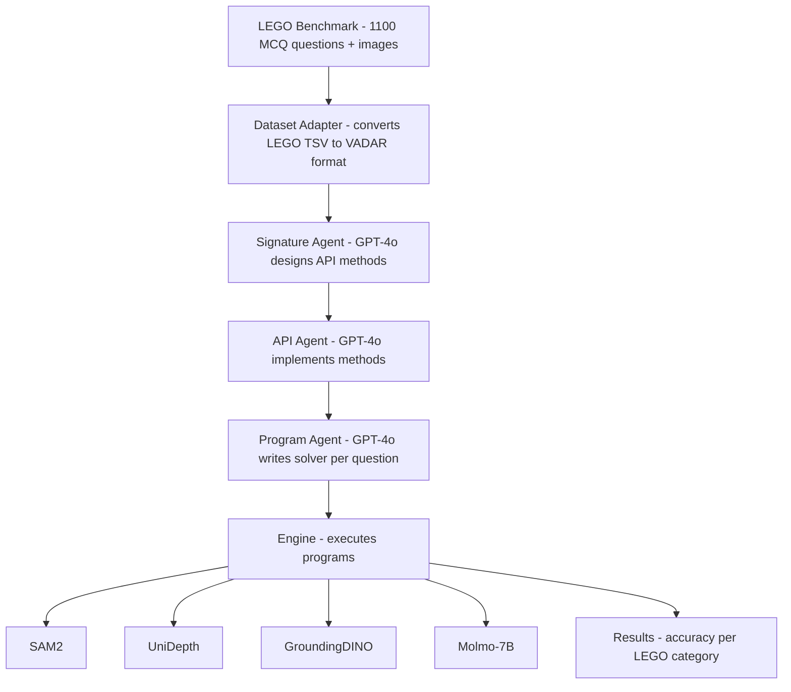

# Run VADAR on LEGO Benchmark via AWS

## Why This Makes Sense

LEGO-Puzzles tests multi-step spatial reasoning (adjacency, rotation, ordering, etc.) — exactly the kind of tasks VADAR was designed for. Instead of feeding LEGO images to a monolithic VLM (like GPT-4o or Gemini), VADAR's agentic approach would:

1. Design custom API methods tailored to LEGO spatial tasks
2. Generate Python programs per question using that API
3. Execute programs with vision models (SAM2, UniDepth, GroundingDINO, Molmo)

This could potentially outperform monolithic VLMs on the harder multi-step reasoning categories.

## Architecture

## Step 1: Create a LEGO Dataset Adapter for VADAR

VADAR expects data in its own format (`annotations.json` with image/question/answer dicts). LEGO uses a TSV with MCQ options (A/B/C/D).

- **File to create**: a new dataset loader in `Vadar-Git/` (e.g., `datasets/lego_dataset.py`)
- **What it does**: reads the LEGO TSV, downloads images, converts each row into VADAR's expected format
- **Key challenge**: LEGO is multiple-choice; VADAR produces free-form answers. Two approaches:
  - **Option A**: Include MCQ options in the question prompt so VADAR programs output a letter (A/B/C/D)
  - **Option B**: Let VADAR produce a free-form answer, then match it to the closest MCQ option
  - Recommend **Option A** for simplicity

## Step 2: Adapt VADAR Prompts for LEGO Tasks

VADAR's prompts (in `prompts/`) are currently tuned for Omni3D/CLEVR/GQA. LEGO tasks involve:

- LEGO brick assembly images (not natural scenes)
- Spatial relationships between bricks (adjacency, stacking, rotation)
- Sequential reasoning (next step, ordering, backwards)
- **Files to modify**: 
  - `prompts/signature_prompt.py` — add LEGO-specific signature generation prompts
  - `prompts/api_prompt.py` — add LEGO-specific API implementation prompts
  - `prompts/program_prompt.py` — add LEGO-specific program generation prompts
  - `prompts/modules.py` — possibly add LEGO-specific primitives
- **Key insight**: LEGO tasks may need new primitives like `count_bricks()`, `get_brick_color()`, `get_spatial_relation()` beyond the existing `loc`, `vqa`, `depth`

## Step 3: Add LEGO Evaluation Metrics

- **File to modify**: `engine/engine.py` — add MCQ accuracy computation
- Map VADAR's per-question results back to LEGO's 11 categories (adjacency, backwards, dependency, height, multi_view, next_step, ordering, outlier, position, rotation, rotation_status)
- Output results in the same CSV format as LEGO benchmark for easy comparison with existing model results in `waleedresults.csv`

## Step 4: AWS Setup and Deployment

**Your `MyInstance.pem` key is already available at `~/.ssh/MyInstance.pem`.**

- **Recommended instance type**: `g5.2xlarge` (1x NVIDIA A10G, 24GB VRAM, ~$1.21/hr) or `g4dn.xlarge` (1x T4, 16GB VRAM, ~$0.53/hr)
  - VADAR's vision models (SAM2, UniDepth, GroundingDINO, Molmo-7B) need at least 16GB VRAM; 24GB is safer
- **Setup on AWS**:
  1. SSH into instance
  2. Clone/upload the combined codebase
  3. Run `setup.sh` to install VADAR dependencies (PyTorch, SAM2, UniDepth, GroundingDINO)
  4. Upload OpenAI API key
  5. Download LEGO dataset
  6. Run the evaluation
- **Estimated costs**: 
  - g5.2xlarge: ~$1.21/hr, full LEGO benchmark (1100 questions) could take 6-12 hours = ~$7-15
  - g4dn.xlarge: ~$0.53/hr, but may need to run models sequentially = ~$5-10
  - Plus OpenAI API costs for GPT-4o calls (signature + API + program generation)

## Step 5: Run and Compare Results

- Run VADAR on the full LEGO benchmark (or start with LEGO-Lite, 220 samples)
- Compare against existing results:
  - GeminiFlash2-0: 54.18% overall
  - GPT4o_MINI: 23.27% overall
- Analyze which LEGO categories benefit most from VADAR's agentic approach

## Key Risks and Considerations

- **LEGO images are synthetic/structured** (not natural photos) — VADAR's vision models (trained on real-world images) may struggle with LEGO brick detection
- **MCQ format mismatch** — VADAR wasn't designed for multiple-choice; prompt engineering will be important
- **Cost** — each run uses GPT-4o API calls + GPU hours; start with a small subset first
- **Sort questions** — LEGO has "sort" type questions (ordering like "BDAC") which need special handling in VADAR's program generation

